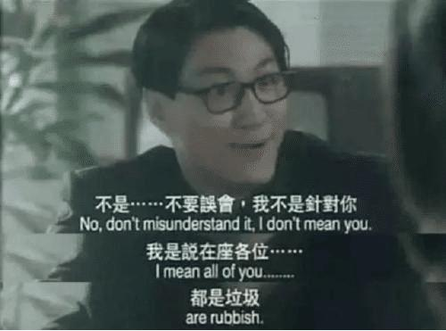
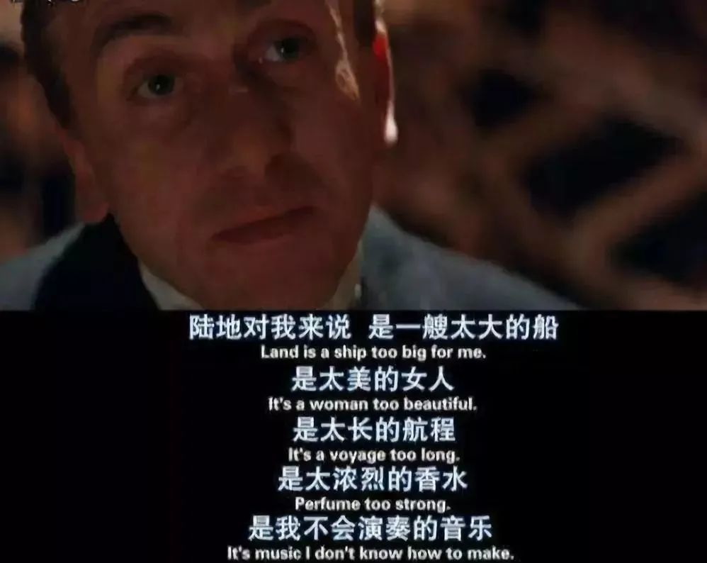

# A project to generate meme with subtitle

Sometimes we could find meme like this:

Or this:

I am making a simple CLI tool to build this kind of meme by Go with local video.

Done:
- [x] Use ffmpeg generate the partial of the whole video.
- [x] Use ffmpeg generate the frames from the part. 
- [x] Use sweepline to find the different frames with different subtitle.

TODO:
- [ ] Integrate the different frames into one.
- [ ] Better algorithm to detect the difference of the subtitles, right now is basded on the (global) binarization and the sweepline to detect the line of the subtitles. It's dumb. 
- [ ] CLI interface to make it works.
- [ ] CD with github action
- [ ] https://xinancsd.github.io/Python/subtitle.html <- Use this impelmentation.